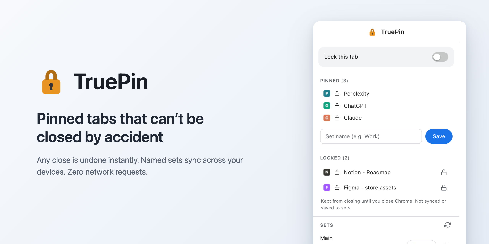
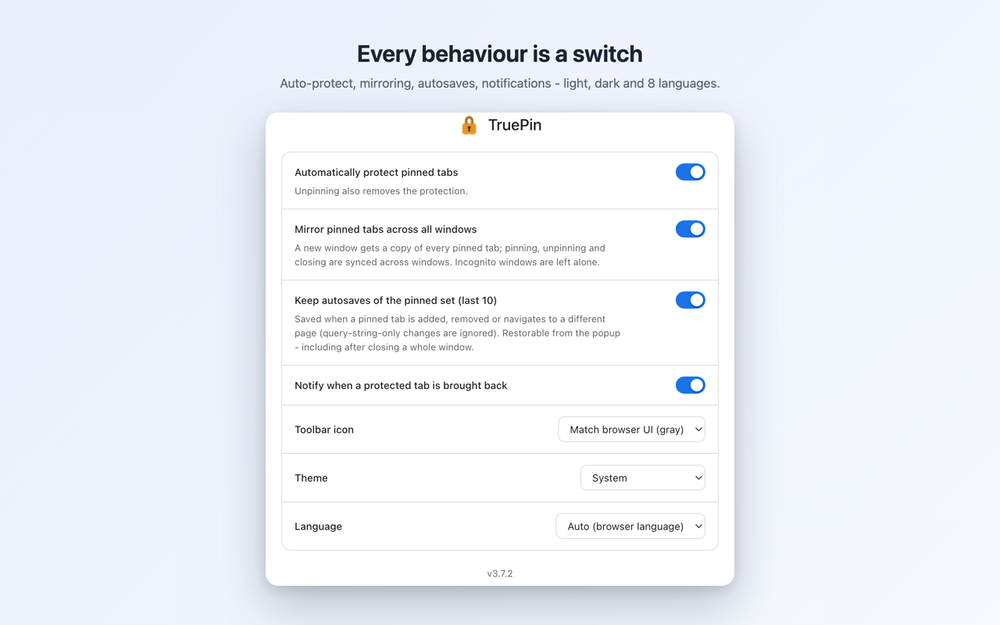

<div align="center">


# TruePin

**Pinned tabs, done right - a Chrome extension that makes pinned tabs impossible to close by accident.**

<p>
  <a href="https://chromewebstore.google.com/detail/truepin/fkgkfmhkdgpeopigpbgohoblocpjakcf"></a>
  
  <a href="#license"></a>
  
  
</p>

**[Install from the Chrome Web Store →](https://chromewebstore.google.com/detail/truepin/fkgkfmhkdgpeopigpbgohoblocpjakcf)**

<br>

<picture>
  <source media="(prefers-color-scheme: dark)" srcset="store/social-preview-dark.png">
  
</picture>

</div>

---

## One rule

> [!IMPORTANT]
> **A protected tab does not close.** Any close - the close button, Cmd+W, a script, another extension - is undone instantly: the tab comes right back, pinned, with its history, with a short notification. No dialogs. To actually close a protected tab, unpin it first, then close it.

Reloading and navigating are free - the tab is not going anywhere, after all. Unpinning is the deliberate act: it drops the protection, the tab becomes a regular one, and its copies in other windows close.

## Features

| | |
|---|---|
| **Close-proof pins** | Every way a pinned tab could close - the X, Cmd+W, a rogue script, another extension - is reversed instantly, with the page and its history intact. |
| **Every window in sync** | Pinned tabs are mirrored into every window; pin, unpin and close stay consistent everywhere. Incognito is left alone. |
| **Named sets** | Save the current pins under a name and restore them in one click. Sets ride Chrome Sync to your other devices. |
| **Autosaves** | The last 10 states of your pinned set, kept automatically - the safety net and the undo, even after you close a whole window. |
| **Per-tab lock** | Lock any single tab, pinned or not, straight from the popup. It holds until the browser session ends, and can optionally be pulled to the front of the tab strip. |
| **Keeps its page** | Typing an address or search in a protected tab, or clicking a link to a clearly different site, opens in a new tab - the protected tab snaps back to its page. |
| **Split-view aware** | Split pairs are recorded and kept adjacent, and restoring a set never tears a live split apart. |
| **Native and private** | Chrome's own look, light / dark / auto, in 8 languages. No network requests, no tracking, no ads. |

---

## Settings, at a glance

<div align="center">
<picture>
  <source media="(prefers-color-scheme: dark)" srcset="store/screenshots/store-options-dark.png">
  
</picture>
</div>

Auto-protect pinned tabs, mirror across windows, autosaves, the reopen notification, and the two keep-its-page interceptions (address bar, cross-site links) are each their own toggle. A "Copy diagnostics" link at the bottom puts the engine's full state on the clipboard for a bug report. The toolbar icon can match the browser UI in gray or stay in color, the theme follows the system or locks to light / dark, and the language auto-detects with a manual override.

---

## How it works

- A tab is protected when it is pinned and auto-protection is on, or when it carries a manual lock from the popup.
- When a protected tab closes, the service worker catches `onRemoved` and brings the tab back via `chrome.sessions` - history, scroll and form state survive. A manual lock is carried over to the reopened tab.
- Unpinning removes the protection; the fake unpin Chrome performs on its own while closing a pinned tab is filtered out by a 500 ms grace window.

<details>
<summary><b>Under the hood</b></summary>

<br>

- If there is no `chrome.sessions` entry for a closed tab, TruePin re-creates it by URL (the page and address survive; the back/forward history does not).
- All state lives in `storage.session`: it survives service worker suspension and resets together with tab ids when the browser restarts.
- No content scripts and no host permissions - the protection runs entirely from the service worker via `chrome.tabs` and `chrome.sessions`. TruePin never reads the content of your pages.

</details>

## Pinned tabs in every window

Pinned tabs form logical groups, and every group is present in every normal window.

- Pin a tab in one window - copies appear in all the others.
- Close a copy - it comes right back; the rule is the same in every window.
- Unpin - the tab stays as a regular one in that window, and its copies elsewhere close.
- Copies are live, independent instances of the same page: navigating inside one does not touch its siblings. Incognito is left alone, and mirroring can be turned off in the options.

<details>
<summary><b>How new windows and reloads stay clean</b></summary>

<br>

- A new window - any normal one (Cmd+N, "open in new window", dragging a tab out) - receives a copy of every pinned tab. The fill waits for the window to finish building its own tab strip (session restore) and adopts its tabs first, so there are no duplicates.
- Reloading the extension or the browser converges without duplicates: the rebuild adopts existing pins first (exact page match, then same-origin for SPA copies whose paths diverged) and only then creates anything.

</details>

## Saved sets and autosaves

The popup (on the toolbar icon) shows the current pinned tabs with favicons and a lock on each protected one, plus three always-visible switches - "Protect pinned tabs" (the global setting), "Pin this tab" (pin or unpin the current tab), and "Lock this tab" (greyed when the active tab is pinned or absent). Below: saving the set under a name, the list of sets, and a collapsible list of autosaves. It also lists any manually-locked non-pinned tabs in a **LOCKED** section.

- The switch at the top is contextual: on a pinned tab it toggles the protection of all pinned tabs; on a regular tab it is that tab's own manual lock.
- **Restoring is a smart diff:** tabs that match by URL stay in place without reloading, missing ones open, extras close, and the order follows the set. The result is mirrored into all windows.
- **Autosaves keep the last 10 states.** An entry is written when the set changes structurally - a pinned tab is added, removed, or navigates to a different page; query-string and hash-only changes do not count. Before a set is restored, the current state is saved first, so a restore is always undoable.
- Named sets live in `storage.sync` and travel to your other machines with Chrome Sync enabled; autosaves are local.

## Split view

Tabs in Chrome's split view are ordinary tabs to the protection: closing a protected split member brings it right back. The scratch tabs Chrome creates for the split gesture (the tab picker and the blank partner) are ephemeral and invisible to the extension, so building or dismissing a split never leaves phantom empty pins behind.

<details>
<summary><b>What survives a reopen, and the honest limit</b></summary>

<br>

Chrome exposes split view to extensions read-only: `tab.splitViewId` can be read and queried, but no API creates or modifies a split (not in Chrome 148, and not yet in the current Chromium source). The honest consequences: a reopened tab returns pinned but outside its former split, mirror copies in other windows are not split, and restoring a set cannot re-create splits.

Within that limit TruePin preserves everything it can:

- Sets and autosaves record the split pairs; the popup marks tabs and sets that carry a pair with a split badge.
- Restoring a set never tears a live split apart: a matched tab that sits in a split is reused in place, and the split wins over exact ordering.
- Mirror copies of a split pair land adjacent in the pin strip of every window, so re-splitting them is one gesture.
- The moment Chrome ships a write API, the stored pairs become real splits on restore.

</details>

## Closing a protected tab

- **Pinned:** unpin it, then close.
- **Manually locked:** turn off "Lock this tab" in the popup, then close.
- There is no other way - that is the point.

---

## Install

**[Chrome Web Store](https://chromewebstore.google.com/detail/truepin/fkgkfmhkdgpeopigpbgohoblocpjakcf)** - one click, updates arrive automatically. Pinned tabs are protected the moment it lands; for settings, right-click the icon and choose **Options**.

<details>
<summary><b>From source (development)</b></summary>

<br>

1. Open `chrome://extensions` and turn on **Developer mode**.
2. Click **Load unpacked** and pick the `extension/` folder of this repository.
3. After a `git pull` with changes, hit **Reload** on the extension card. If the repository folder moves, remove the extension and load it again from the new path.

</details>

## Privacy

TruePin runs entirely in your browser. It **makes no network requests** and has no analytics, no tracking and no ads - nothing is ever sent to the developer or anyone else. It has no host permissions and no content scripts, so it never reads the content of your pages. Named sets travel only through your own Chrome Sync, under Google's terms. Settings and sets sync between your browsers the same way; the export button in Options writes them to a plain JSON file on your machine (there are no secrets in TruePin, so the file is clean), and import merges sets by name without ever deleting ones the file does not mention. Updates from the Web Store apply silently at a quiet moment - your settings survive every version.

Full policy: [PRIVACY.md](PRIVACY.md).

## Honest limits

- Closing a whole window and Cmd+Q are not undone - those are window-level acts. Cmd+Shift+T brings the window back, and the pinned set is also in the autosaves and mirrored in other windows.
- With auto-protection off, pinned tabs close normally, and closing a copy is then synced across windows.
- A reopened tab gets a new tab id; for pages without a `chrome.sessions` entry, the re-create fallback loses the back/forward history (the page and URL survive).
- The mirror keeps one pin per page per window: a second pin of the exact same page stays a local pin in that window and is not copied to the others. Different pages of the same site are each mirrored normally.
- The pinned set itself is persisted (the "canon") and windows converge to it on every startup: leftover duplicates from crashes or older versions are closed, not multiplied - even for chat-style apps that redirect every copy to its own unique URL. Tabs that arrive already pinned (session restore, reopen-closed) are reconciled against the canon rather than trusted blindly; a page you explicitly pin is always kept.
- A safety stop caps how many tabs the extension will ever create per minute. If something unexpected still goes wrong, TruePin stalls and shows one notification instead of flooding the tab strip.
- The address-bar and cross-site-link interception cannot truly cancel a navigation (MV3 has no blocking API): the page starts to change, then snaps back - a brief flash. A prerendered omnibox suggestion ("Preload pages" on) can occasionally slip through and navigate in place.
- Cross-site is judged by the registrable domain with a small built-in heuristic, not a full public-suffix list; exotic TLD layouts may be judged same-site. Sign-in flows that must return to the page (OAuth) complete in the new tab instead - turn the link toggle off if that gets in the way.
- If TruePin ever finds MASS-duplicated pins (many sites duplicated at once - the signature of a bug, never of deliberate pinning), it heals them where truth is being established: one pin per affected site is kept, preferring one recorded in a saved set, the previous state is parked in Autosaves for one-click undo, and a notification says what happened.

## Development

`extension/` is a Manifest V3 extension with no build step:

- `background.js` - reopen-protection, mirror groups, sets and autosaves
- `popup.*` and `options.*` - the UI
- `i18n.js` + `_locales/` - 8 languages
- `icons/`

**Tests** - 42 end-to-end scenarios on Puppeteer against a real Chrome for Testing: every close method undone, mirroring across three windows, cold-start convergence without duplicates, snapshot diff-restore, the split-view rules, the keeps-its-page interceptions, mass-duplication healing, localization, and a clean service worker log. Plus four standalone regression repros:

```bash
cd test && npm install && npm test          # HEADFUL=1 npm test to watch
npm run test:canon      # fresh-profile regression: duplicates never multiply
```

## Family

TruePin protects your pinned tabs. [TrueTabs](https://github.com/datysho/truetabs)
runs everything else: no duplicate tabs, stale tabs auto-archived (always
undoable), tabs grouped by site or by AI topic. The names mirror the technical
contract: **TrueTabs never closes, moves, groups or archives a pinned tab** -
the two coexist by construction.

Since v3.12.0 the two also speak: TruePin answers which regular tabs are
locked to the front, and TrueTabs reserves that stretch of the strip - the
agreed order is *pinned, then locked, then groups, then the rest*. Only these
two extensions can talk (browser-attested ids; every other sender gets
silence), and either one works exactly as before when the other is absent.
A locked tab you place into a tab group yourself stays there - the front
pull resumes when it leaves the group.

- [TrueTabs](https://github.com/datysho/truetabs) - the Arc-style tab butler
  for Chrome.

## License

[MIT](LICENSE).

## Support

TruePin is free and open source, built and maintained by one person. No ads, no tracking, nothing paywalled - ever.

If it has earned a spot in your browser, you can support the work below. It is entirely optional; it just helps keep the project moving.

**[Donate via PayPal](https://www.paypal.com/donate/?hosted_button_id=88K7MWF22B2FU)** - every donor gets a permanent line in [SUPPORTERS.md](SUPPORTERS.md).

Prefer the $0 route? A ⭐ on this repo or a [review on the Chrome Web Store](https://chromewebstore.google.com/detail/truepin/fkgkfmhkdgpeopigpbgohoblocpjakcf/reviews) helps just as much.

<div align="center">
<br>
<sub>Thanks for using it. 💛</sub>
</div>
